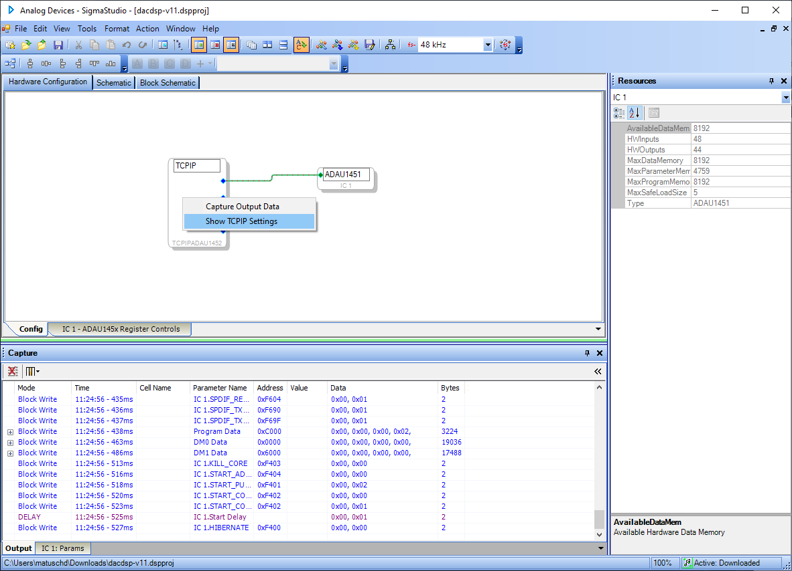
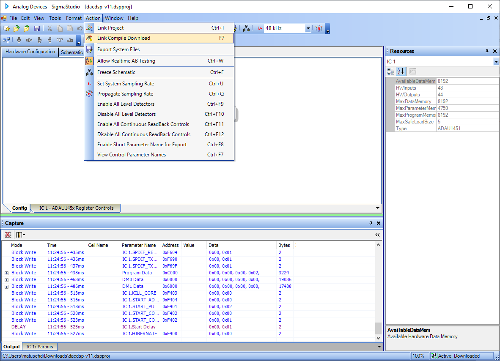
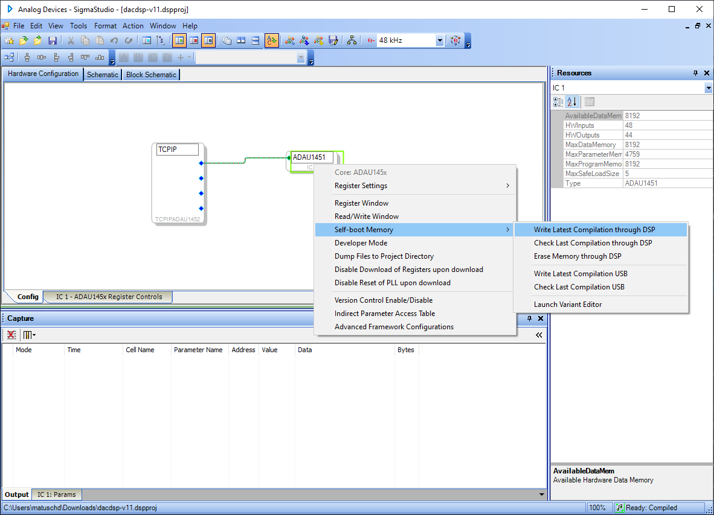
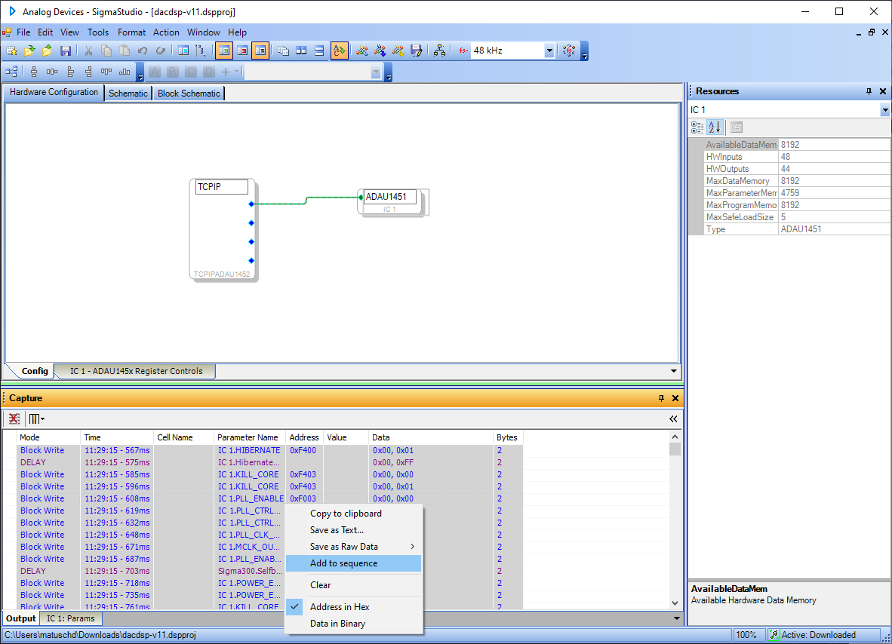
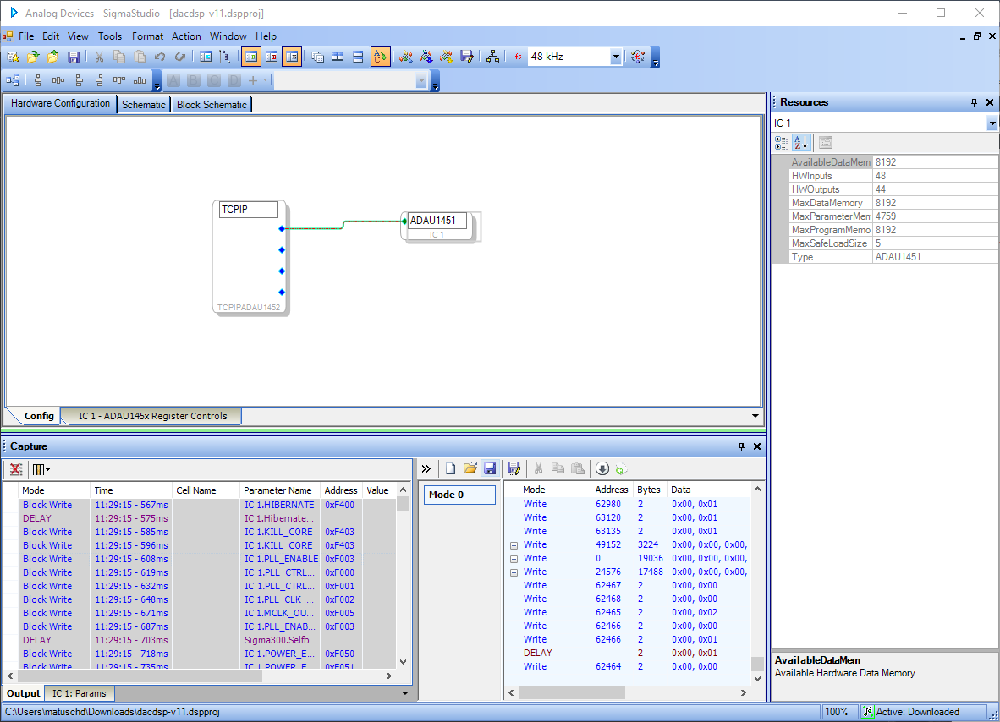
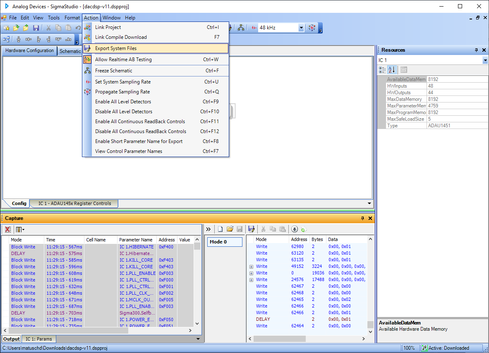
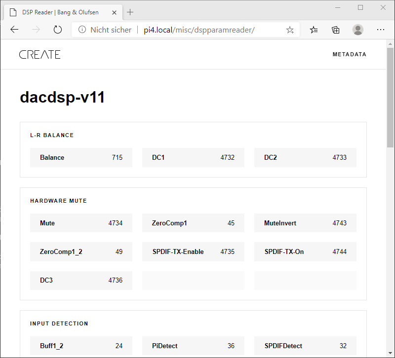
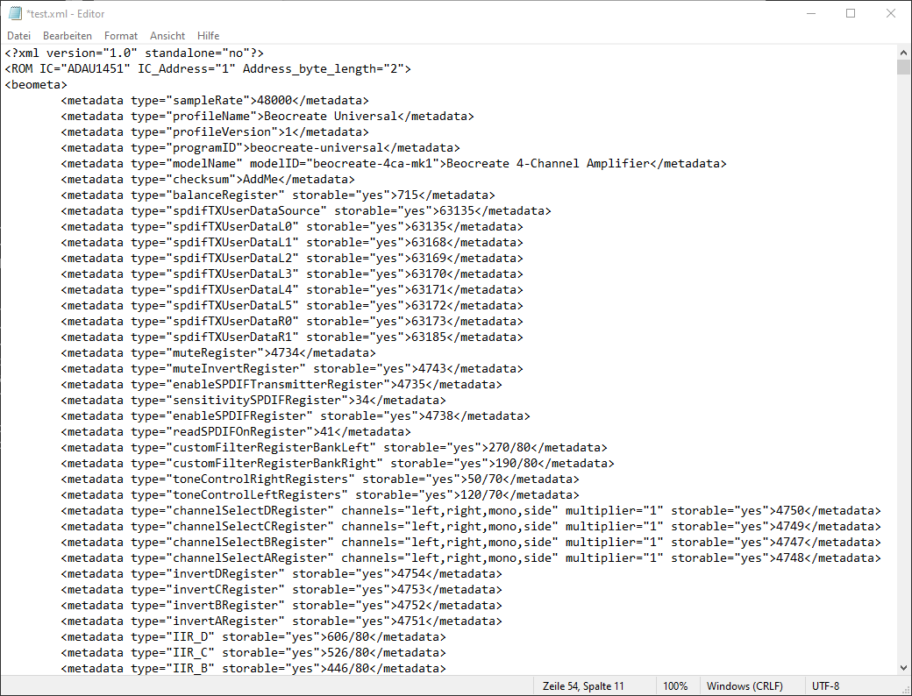

# Adapting existing profiles

While we provide pre-configured profiles, you might want to add more functionalities or simply remove some blocks. 
This document shows how this can be done easily. It's recommended to start with a working project as creating one from scratch can
be quite complicated.

## Open and edit the project

## Connect to the Pi

In the Hardware configuration/TCPIP block, right click and set the IP address of your Pi. Then press "Open connection"


## Test

Use the Action/Link Compile Download menu to push the DSP program to the Pi. 


## Create a DSP profile

First, make sure that the "Capture" window is empty. If it's not, press "Clear all output data".
Now right-click on the ADAUxxxx component and select "Self-Boot Memory/Write latest compilation through DSP"



This will take some time. All communication with the DSP is being recorded in the Capture windows. Now select all entries in the Capture window and select "Add to Sequence".



Now save the sequence to an XML file



That's it. You have created a new DSP Profile. 

## Add metadata

While you can already deploy the DSP profile that you created, you won't be able to control parameters e.g. using the GUI in HiFiBerryOS. For these features the software on the Pi requires additional metadata to known how to control parameters of this profile. To add these metadata, first export system files for this project:



This will create a lot of file, but you only need the .params file. It includes data of all controls and their adresses. Based on this, you could now create metadata by yourself, but there's an easier way in HiFiBerryOS. 
Point your browser to http://hifiberry.local/misc/dspparamreader (replace the hifiberry.local by the name or IP address of your Pi)


Drag and drop the params file to this web page.



No click on Metadata/Show or Hide XML.


Copy the metadata.

Open the DSP profile that you have created before and copy the metadata into the file just starting after the "<ROM>..." line
  

  
You might want to edit some data liek sample rate, profile name or model name.

Last thing you need to add is the checksum of the profile. This isn't included in the params file. To get the checksum, make sure your program is deployed on the Pi and display it using dsp-toolkit:

```
# dsptoolkit get-checksum
CB71C7D437125A4CE066798726B1D25D
```

After adding this, the profile is ready. You can just copy it onto your Pi and either deploy it directly using

```
dsptoolkit install-profile profile.xml
```

If you're using HiFiBerryOS, copy it to /opt/beocreate/beo-dsp-programs. After a restart, you will find the new DSP profile in the selection of available profiles in the HiFiBerryOS sound settings.
